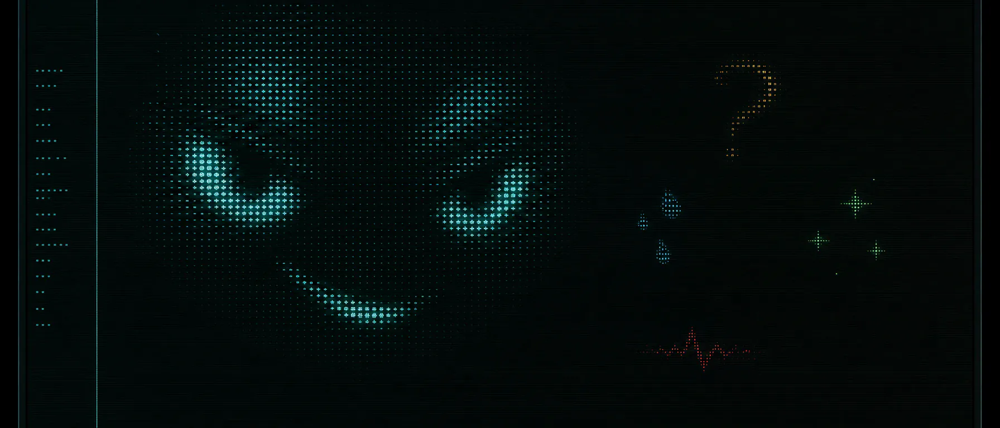

# pi-ghost-in-the-machine

<p align="center">
  
</p>

A tiny ASCII face living in Ghostty. It follows Pi from thought to work to completion, changes expression on failure, and disappears when its pane is no longer relevant.

The package bundles the Pi extension, lifecycle shaders, Ghostty controller, and optional Herdr focus/sidebar routing. No separate shader checkout or shell wrapper.

## Requirements

- Pi 0.80.4+
- Ghostty 1.3+
- Node 22.19+, Bash, `pgrep`, and `jq`
- Herdr 0.7.4+ for focused-pane and sidebar routing (optional)

## Install

```sh
pi install git:github.com/iurysza/pi-ghost-in-the-machine
~/.pi/agent/git/github.com/iurysza/pi-ghost-in-the-machine/scripts/setup.sh
```

Then reload Pi:

```text
/reload
```

The setup script adds the stable Ghostty state fragment, links the Herdr plugin when available, starts its per-socket watcher, and selects `idle`. For manual setup, runtime files, and diagnosis, see the [engineering map](ai-artifacts/docs/index.md).

## Lifecycle and commands

`idle -> thinking -> working -> done`; a failed tool settles on `error`. Shutdown, non-Pi focus, or a collapsed Herdr sidebar selects `off`. Visible states remain for at least two seconds so Ghostty can compile the selected shader.

| Command | Action |
| --- | --- |
| `/ghost-idle`, `/ghost-thinking`, `/ghost-working`, `/ghost-done`, `/ghost-error` | Force a visible state |
| `/ghost-off` / `/ghost-on` | Hide or restore the desired state |
| `/ghost-disable` | Disable automatic transitions for this Pi session |
| `/ghost-status` | Show extension, sidebar, watcher, and shader state |

## Development

```sh
npm install
npm run generate
npm run check
npm test
npm pack --dry-run
```

Edit `shaders/ghost-in-the-machine.glsl`, then commit every regenerated file under `shaders/variants/`. Architecture, lifecycle, watcher protocol, diagnostics, performance, and release checks live in the [engineering docs](ai-artifacts/docs/index.md).

Derived from [isoden/claude-terminal-face](https://github.com/isoden/claude-terminal-face). See [NOTICE](NOTICE) and [LICENSE](LICENSE).
