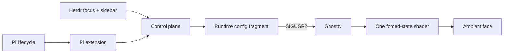
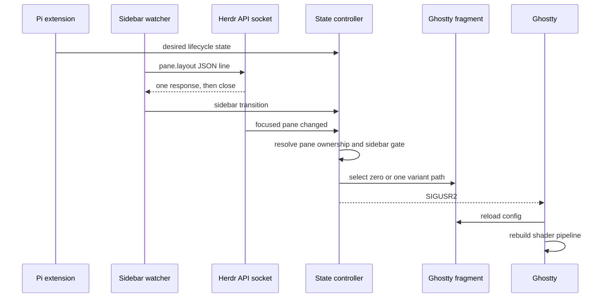

# Ghost in the Machine — Architecture

> How Pi lifecycle becomes one Ghostty shader path.

## 1. System overview

The package has three runtime faces:

| Face | Responsibility | Key files |
|---|---|---|
| Pi extension | Maps session and tool events to lifecycle intent; exposes manual commands. | `src/index.ts` |
| Controller | Remembers pane state, resolves focus/sidebar gates, selects one shader path, reloads Ghostty. | `scripts/ghost-state.sh` |
| Sidebar watcher | Polls Herdr's API socket and sends sidebar transitions to the controller. | `scripts/sidebar-watcher.mjs` |

The shader is the render plane. It receives no Pi or Herdr identity.

## 2. Runtime flow

Ghostty does not watch shader contents. The controller changes the configured path, then signals Ghostty. Multiple `custom-shader` entries form a pipeline, not alternatives, so the fragment configures zero or one generated variant.

## 3. State ownership

The control plane owns state, focus, config, and reload. The render plane owns pixels.

Read the [`Semantic map`](./SEMANTIC_MAP.md) before changing state behavior. Its distinction between desired, pane, active, and sidebar state is the project’s main debugging vocabulary.

Per-pane memory exists because Ghostty is global while Herdr panes are local. Focus routing chooses which remembered pane state becomes visible; it must not let one pane’s state leak into another.

## 4. Herdr and watcher contract

- Herdr serves one newline-delimited JSON response per API connection, then closes it.
- Polls never overlap. Each request is `pane.layout`; the watcher waits for its response before scheduling the next poll.
- `result.layout.area.x <= 4` means collapsed for the verified desktop layout. Hidden-sidebar/mobile behavior remains unknown; do not add guesses.
- Watcher identity is keyed by canonical `HERDR_SOCKET_PATH`, never a pane, tab, or `herdr-client.sock`.
- The watcher detects sidebar state. The controller remains authoritative for pane memory, active shader selection, and focus/sidebar races.

The watcher uses Node to avoid steady-state shell process churn. Bash runs only when a sidebar transition reaches the controller. See [`Watcher performance`](./docs/WATCHER_PERFORMANCE.md) for measured costs.

## 5. Change hotspots

| If changing | Inspect first |
|---|---|
| event mapping or command behavior | `src/index.ts`, [`Lifecycle`](./docs/lifecycle.md) |
| focus/sidebar ownership | `ghost-state.sh`, `sidebar-watcher.mjs`, [`Semantic map`](./SEMANTIC_MAP.md) |
| Ghostty reload/config path | `ghost-state.sh`, `setup.sh`, [`Operations`](./docs/OPERATIONS.md) |
| shader placement or state visuals | `shaders/ghost-in-the-machine.glsl`, [`Visual model`](./docs/VISUAL_MODEL.md) |

## 6. Invariants

- One source shader generates every visible lifecycle variant.
- `off` removes the shader path; it is visibility, not an animated face state.
- Runtime state stays outside the package so package updates do not own user state.
- The stable runtime fragment matters more than `active.state`: it is Ghostty’s actual input.
- Any controller change needs a test, and watcher changes also need live Herdr verification.
