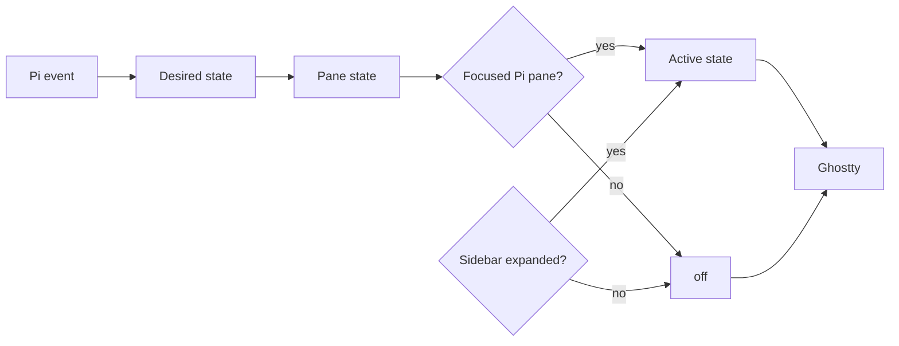

# Ghost in the Machine — Semantic Map

> Concise map of the state names, layers, and ownership rules.

## 1. Domain concepts

| Concept | Meaning | Owner |
|---|---|---|
| Desired state | What one Pi session currently wants to show. | Pi extension |
| Pane state | That Herdr pane’s remembered controller selection. | Controller runtime state |
| Active state | The last state selected for Ghostty’s global fragment. | Controller runtime state |
| Sidebar state | Expanded/collapsed visibility gate. | Sidebar watcher + controller |
| Lifecycle state | `idle`, `thinking`, `working`, `done`, or `error`. | Pi extension intent |
| `off` | No configured face shader; visibility only. | Controller |
| Runtime fragment | Ghostty include file that contains zero or one `custom-shader` path. | Controller |

## 2. State flow

These copies can legitimately disagree. A focused pane can remember `working` while the active global shader is `off` because the sidebar is collapsed. A failed Ghostty reload can leave rendered pixels behind the controller’s selected active state.

## 3. Boundary rules

| Boundary | Rule |
|---|---|
| Pi → controller | Pi sends lifecycle intent; it does not write Ghostty config. |
| Controller → pane memory | A Herdr Pi pane keeps its last selected lifecycle state. |
| Focus → active state | Focus chooses remembered state; it does not rewrite desired state. |
| Sidebar → active state | Collapse selects `off`; expansion restores the focused pane’s remembered state. |
| Controller → Ghostty | Write one fragment path, then signal reload. |
| Shader → pixels | Shader has no Pi/Herdr identity and never owns routing state. |

## 4. Invariants

- `idle`, `thinking`, `working`, `done`, and `error` have semantic meaning.
- `off` only controls visibility.
- Manual commands and automatic lifecycle events converge on the controller.
- A failed tool marks the whole turn; later successful tools do not clear the turn’s error.
- Focus changes must not erase a different pane’s memory.
- Runtime state is diagnostic evidence, not a second source of user intent.

## 5. Debug order

When a face is wrong, diagnose in this order:

1. Is the desired pane state correct?
2. Is the focused pane the one expected?
3. Is the sidebar gate expanded?
4. Does `ghostty-state.conf` select the expected variant?
5. Did Ghostty reload and compile it?

For commands and timing, read [`Lifecycle`](./docs/lifecycle.md). For concrete paths and diagnosis commands, read [`Operations`](./docs/OPERATIONS.md).
