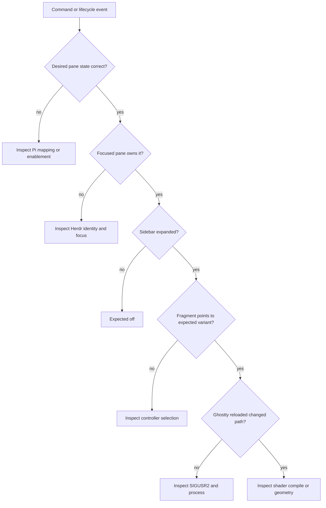

# Operations

> Setup, runtime paths, diagnosis, verification, and release checks.

## 1. Setup

Normal install:

```sh
pi install git:github.com/iurysza/pi-ghost-in-the-machine
~/.pi/agent/git/github.com/iurysza/pi-ghost-in-the-machine/scripts/setup.sh
```

Then reload Pi:

```text
/reload
```

`setup.sh` adds Ghostty’s stable runtime fragment, links the bundled Herdr focus plugin when available, selects `idle`, and enables watcher support. A Pi session started **inside Herdr** starts the sidebar watcher; invoking `watch-start` from an ordinary shell is intentionally a no-op.

### Manual Ghostty setup

Ask the controller for the exact fragment path. The default is under `~/.local/state`, but `XDG_STATE_HOME` changes it.

```sh
~/.pi/agent/git/github.com/iurysza/pi-ghost-in-the-machine/scripts/ghost-state.sh config-path
```

Paste that output into Ghostty’s config:

```ini
config-file = ?<path printed by config-path>
custom-shader-animation = true
```

Then initialize the face:

```sh
~/.pi/agent/git/github.com/iurysza/pi-ghost-in-the-machine/scripts/ghost-state.sh apply idle
```

For Herdr routing, link the plugin from an environment where `herdr` is available, then start a Pi session inside Herdr.

## 2. Runtime layout

Runtime truth lives under `${XDG_STATE_HOME:-$HOME/.local/state}/ghost-in-the-machine/`:

```text
ghostty-state.conf       # Ghostty's actual shader input
active.state             # controller's last selected state
sidebar.state            # expanded/collapsed visibility gate
panes/*.state            # remembered Pi pane states
watchers/<socket-key>/   # one watcher identity per canonical API socket
```

The stable fragment matters more than `active.state`; it is what Ghostty loads. A manual `/ghost-*` command separates lifecycle mapping problems from render failures.

## 3. Diagnose from intent toward pixels



`ghost-state.sh status` reports the socket, watcher PID, sidebar gate, and active state.

## 4. Sidebar watcher

Per-socket evidence lives at:

```text
watchers/<socket-key>/
  socket-path
  watcher.pid
  watcher.log
  start.lock/
```

The key is the SHA-256 of the canonical API socket path. Read `socket-path` before trusting a stale PID. `watcher.log` records transitions, controller outcomes, request errors, latency, and a stop summary.

The watcher exits after 100 consecutive API failures. Failed sidebar controller actions retry after one second without treating unchanged geometry as a new transition. `herdr-client.sock` is never an API target.

## 5. Live verification

On macOS, from a focused Pi pane inside Herdr with Ghostty running:

```sh
scripts/verify-live-sidebar.sh
```

It checks singleton startup, collapse-to-off, lifecycle suppression while collapsed, expansion restoration, and stop/restart. It leaves the sidebar expanded and the watcher running.

## 6. Release

```sh
npm run generate
npm run check
npm test
npm pack --dry-run
```

Then visually verify thinking, working, error, and done; focus a non-Pi Herdr pane and return; unfocus and refocus Ghostty. Run the live sidebar script when watcher behavior changes.

See [`Watcher performance`](./WATCHER_PERFORMANCE.md) for the measured Bash-versus-Node trade-off.
