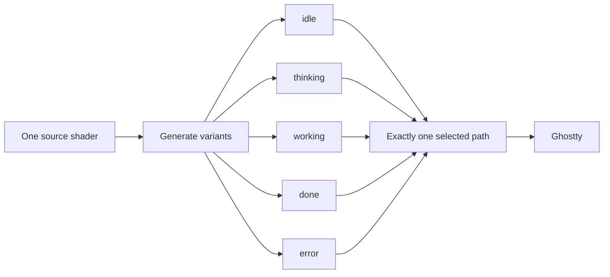

# Visual Model

> The shader contract: variants, placement, and visual invariants.

## 1. Variant model



Variants differ only by `FORCED_STATE`. Change the source, regenerate every variant, and commit them together:

```sh
npm run generate
```

`off` normally removes `custom-shader`; it is not another animated state.

## 2. Placement

```text
viewport
┌──────────────────────────────┐
│  ↔ 0.5% minimum footprint gap│
│       ghost center: 40% ↓    │
│       size: 12.6% of height  │
│                              │
└──────────────────────────────┘
```

The gap clamps the full animated footprint, including drift and decorations. The face renders on a dense `8 × 17 px` virtual ASCII grid so small features remain legible; sidebar placement separately uses real `16 px` terminal-cell width.

## 3. Visual invariants

- Ghostty coordinates are top-down in the tested renderer.
- Shared breathing, drift, gaze, and blink make every state one creature.
- State-specific color and decorations carry the quick read: yellow/question, blue/effort, green/sparkles, red/worry.
- `iFocus == 0` returns the untouched terminal texture.
- Herdr visibility belongs in the controller, never GLSL.

Read [`Architecture`](../ARCHITECTURE.md) before changing control/render boundaries. Read [`Lifecycle`](./lifecycle.md) before changing what a state means.
