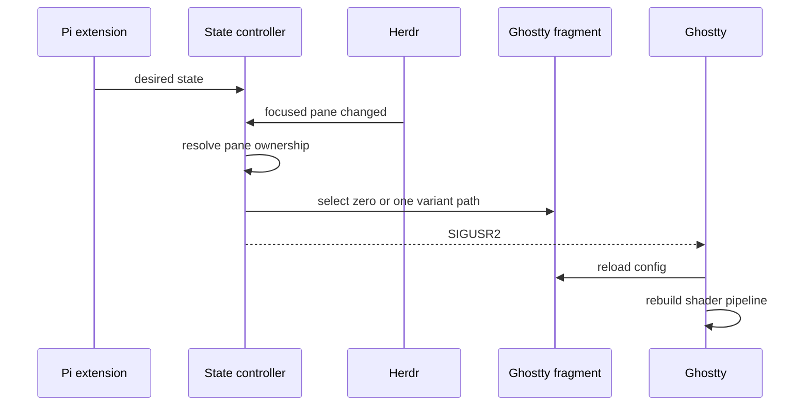

# Architecture

## Load-bearing quirks

- Ghostty does **not** watch shader contents. Change the configured path, then send `SIGUSR2`.
- Multiple `custom-shader` entries form a pipeline; they are not alternatives. Configure zero or one variant.
- Herdr does not forward the original OSC cursor-color state channel. State travels outside the child terminal.
- Ghostty is global; Herdr panes are local. Per-pane memory plus focus routing prevents state leakage.
- Runtime state lives outside the package. Package updates may move code; the Ghostty include path must remain stable.

No daemon is needed. Small files and a signal form the handoff. See [[ai-artifacts/docs/semantic-map|semantic map]] for ownership and [[ai-artifacts/docs/operations-and-verification|operations]] for failure isolation.
