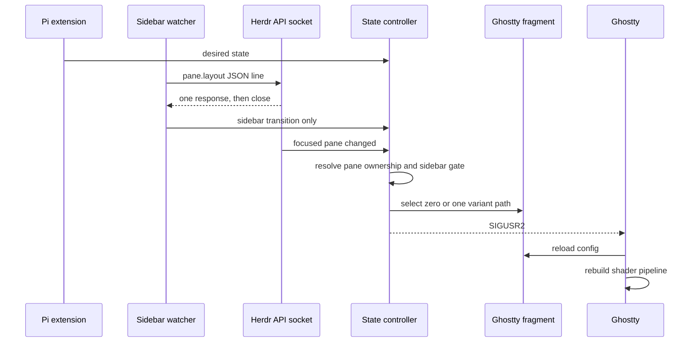

# Architecture

## Load-bearing quirks

- Ghostty does **not** watch shader contents. Change the configured path, then send `SIGUSR2`.
- Multiple `custom-shader` entries form a pipeline; they are not alternatives. Configure zero or one variant.
- Herdr does not forward the original OSC cursor-color state channel or expose sidebar visibility. State travels outside the child terminal.
- Herdr's request API serves one newline-delimited JSON response per connection and closes it. The watcher process persists; each `pane.layout` connection does not.
- Polls never overlap. Each one sends `{"method":"pane.layout","params":{}}`, parses `result.layout.area.x` plus `focused_pane_id`, and waits for the response before scheduling the next request.
- With Herdr's default desktop geometry, `area.x <= 4` means collapsed and larger values mean expanded. Hidden-sidebar mode remains ambiguous with the mobile layout; do not add unverified heuristics.
- One watcher is keyed by canonical `HERDR_SOCKET_PATH`, never by pane, tab, or `herdr-client.sock`.
- The watcher detects only. On expansion it passes the layout's focused pane ID so `ghost-state.sh` can inspect that pane directly before restoring its memory. The controller remains authoritative for sidebar gating, active shader state, and collapse races.
- Ghostty is global; Herdr panes are local. Per-pane memory plus focus routing prevents state leakage.
- Runtime state lives outside the package. Package updates may move code; the Ghostty include path must remain stable.

The only long-lived helper is the per-socket Node watcher. Its default interval is 50ms, though live socket latency limits the observed rate. It uses no steady-state child processes; Bash runs only on sidebar transitions. Small files and a signal still form the Ghostty handoff. See the [semantic map](semantic-map.md) for ownership and [operations](operations-and-verification.md) for failure isolation.
