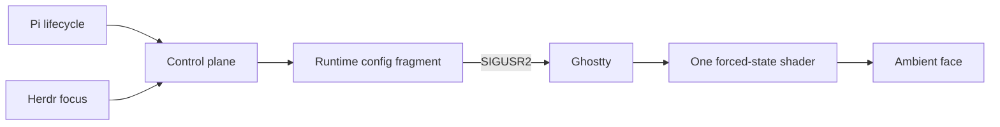

# Engineering Map

The project translates Pi lifecycle into one Ghostty shader path. The hard parts are state ownership, reload semantics, and focus—not file layout.

Read [[ai-artifacts/docs/semantic-map|semantic map]] when state appears stale or belongs to the wrong pane. Read [[ai-artifacts/docs/architecture|architecture]] before changing boundaries or replacing the controller. Read [[ai-artifacts/docs/lifecycle|lifecycle]] before changing event mapping or timing. Read [[ai-artifacts/docs/visual-model|visual model]] before touching GLSL. Read [[ai-artifacts/docs/operations-and-verification|operations]] for setup, diagnosis, and shipping.

The source shader came from [isoden/claude-terminal-face](https://github.com/isoden/claude-terminal-face). This repository owns the Pi, Ghostty path-swap, Herdr, packaging, and later visual work.
