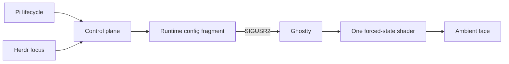

# Engineering Map

The project translates Pi lifecycle into one Ghostty shader path. The hard parts are state ownership, reload semantics, and focus—not file layout.

Read the [semantic map](semantic-map.md) when state appears stale or belongs to the wrong pane. Read [architecture](architecture.md) before changing boundaries or replacing the controller. Read [lifecycle](lifecycle.md) before changing event mapping or timing. Read the [visual model](visual-model.md) before touching GLSL. Read [operations](operations-and-verification.md) for setup, diagnosis, and shipping. Read [sidebar watcher performance](sidebar-watcher-performance.md) for the measured Bash-versus-Node trade-off.

The source shader came from [isoden/claude-terminal-face](https://github.com/isoden/claude-terminal-face). This repository owns the Pi, Ghostty path-swap, Herdr, packaging, and later visual work.
