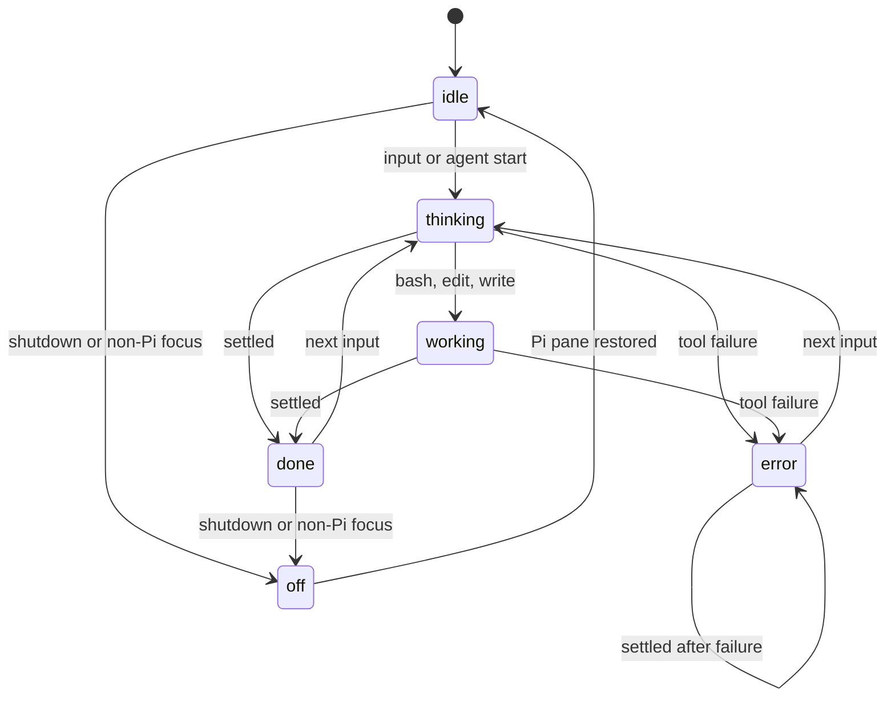

# Lifecycle

Raw events arrive faster than Ghostty compiles this shader. The extension keeps each applied state for two seconds and retains only the newest queued request. This shows progression without replaying every read/write alternation after the turn ends.

A tool failure marks the whole turn. Settlement stays `error`; a later success in the same turn does not erase it. `/ghost-off` is temporary. `/ghost-disable` suppresses automatic transitions for the session.

Focus transitions do not change desired or pane state. They only choose which remembered state becomes active. See [[ai-artifacts/docs/semantic-map|semantic map]].
