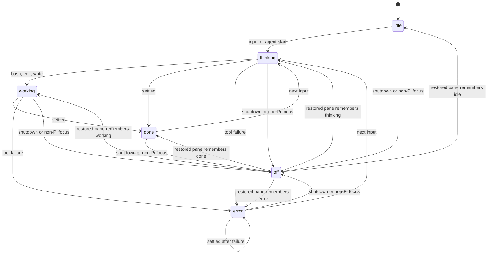

# Lifecycle

> How Pi events become face state, and why not every event is rendered.

## State model

## Timing

Ghostty compiles shader pipelines more slowly than raw Pi events arrive. The extension keeps each applied visible state for two seconds and retains only the newest queued request. That preserves meaningful progression without replaying every read/write alternation after a turn settles.

A tool failure marks the whole turn. Settlement stays `error`; later success in that turn does not erase it. A new input clears the failure marker.

## Commands

| Command | Meaning |
|---|---|
| `/ghost-idle` … `/ghost-error` | Force a lifecycle state. |
| `/ghost-off` | Hide until the next Pi event. |
| `/ghost-on` | Enable and restore the session’s desired state. |
| `/ghost-disable` | Suppress automatic transitions for this Pi session. |
| `/ghost-status` | Report extension, sidebar, watcher, and shader state. |

Manual commands and automatic events use the same controller boundary. Their ordering matters because Ghostty’s output is global; see the [`Semantic map`](../SEMANTIC_MAP.md) before changing queue behavior.

## Focus and sidebar behavior

Focus transitions do not change desired or pane state. They choose which remembered pane state becomes active. A collapsed sidebar selects `off`; expansion restores the currently focused Pi pane’s remembered lifecycle state, not always `idle`.
