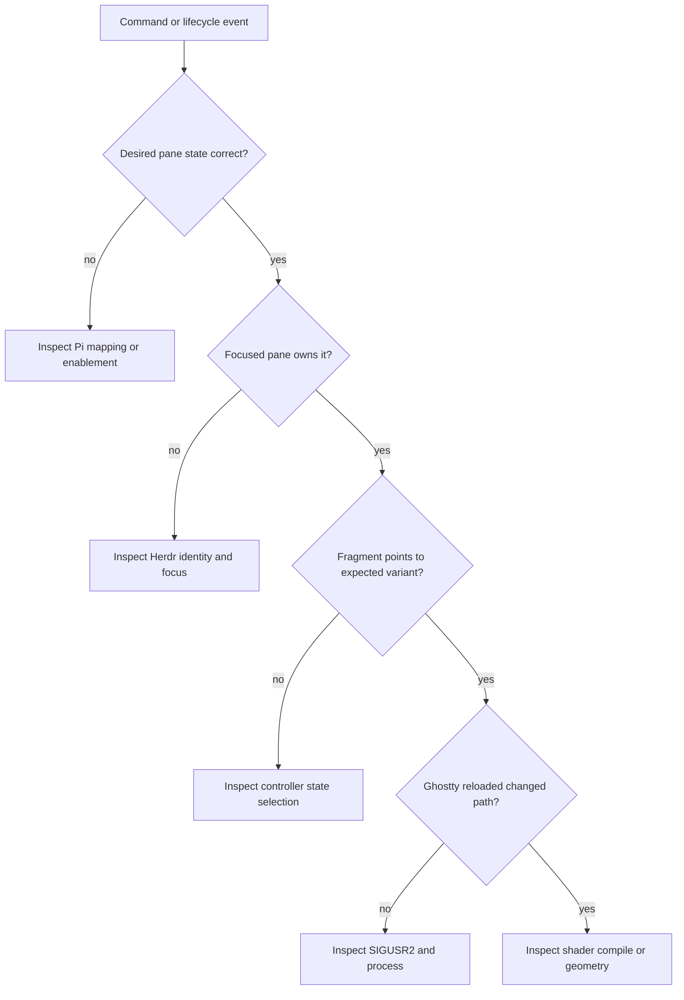

# Operations and Verification

## Setup

The normal install path is:

```sh
pi install git:github.com/iurysza/pi-ghost-in-the-machine
~/.pi/agent/git/github.com/iurysza/pi-ghost-in-the-machine/scripts/setup.sh
```

`setup.sh` adds the stable runtime fragment to Ghostty's config, links the bundled Herdr plugin when Herdr is installed, starts the per-socket sidebar watcher, selects `idle`, and requests a Ghostty reload. Reload Pi with `/reload` afterward.

For manual Ghostty setup, add:

```ini
config-file = ?/Users/you/.local/state/ghost-in-the-machine/ghostty-state.conf
custom-shader-animation = true
```

Then initialize the shader and, if needed, Herdr routing:

```sh
~/.pi/agent/git/github.com/iurysza/pi-ghost-in-the-machine/scripts/ghost-state.sh apply idle
herdr plugin link ~/.pi/agent/git/github.com/iurysza/pi-ghost-in-the-machine
~/.pi/agent/git/github.com/iurysza/pi-ghost-in-the-machine/scripts/ghost-state.sh watch-start
```

## Runtime and diagnosis

Runtime truth lives under `~/.local/state/ghost-in-the-machine/`:

```text
ghostty-state.conf       # Ghostty's actual shader input
active.state             # controller's last selected state
sidebar.state            # expanded/collapsed visibility gate
panes/*.state            # remembered Pi pane states
watchers/<socket-key>/   # one watcher identity per canonical API socket
```

Diagnose from intent toward pixels:



The stable runtime fragment matters more than `active.state`; it is Ghostty’s actual input. A manual `/ghost-*` command separates lifecycle mapping from render failures.

## Sidebar watcher

`ghost-state.sh status` reports the canonical API socket, watcher PID, sidebar gate, and active shader. Per-socket runtime evidence is:

```text
watchers/<socket-key>/
  socket-path
  watcher.pid
  watcher.log
  start.lock/
```

The directory key is the SHA-256 of the canonical socket path. Read `socket-path` before trusting a stale PID. `watcher.log` records transitions, controller results, request errors and latency, plus a stop summary. `watch-start` recovers dead PID/lock files and returns the existing process for the same socket, even when another checkout started it. `watch-stop` validates the exact socket and runtime-file arguments before signaling it. Direct Pi sessions outside Herdr start no watcher, and `herdr-client.sock` is never a target.

The watcher exits after 100 consecutive API failures. It retries failed sidebar controller actions after one second without treating repeated geometry as a new transition.

Live verification on macOS:

```sh
scripts/verify-live-sidebar.sh
```

The script requires a focused Pi pane inside Herdr. It proves singleton startup, collapse-to-off, lifecycle suppression while collapsed, expansion restoration, and stop/restart. It leaves the sidebar expanded and the watcher running.

Reproduce the old/new idle comparison with no Ghostty state changes:

```sh
node scripts/benchmark-sidebar-watchers.mjs \
  --seconds 15 \
  --output ai-artifacts/docs/sidebar-watcher-performance.md
```

See [sidebar watcher performance](sidebar-watcher-performance.md) for the measured result and its limits.

## Release

Before shipping:

```sh
npm run generate
npm run check
npm test
npm pack --dry-run
```

Then verify thinking, working, error, and done visually; focus a non-Pi Herdr pane and return; unfocus and refocus Ghostty. Run the live sidebar script when watcher behavior changes. The tarball must contain the extension, controller, watcher, setup script, shaders, Herdr plugin, attribution, and this map.
