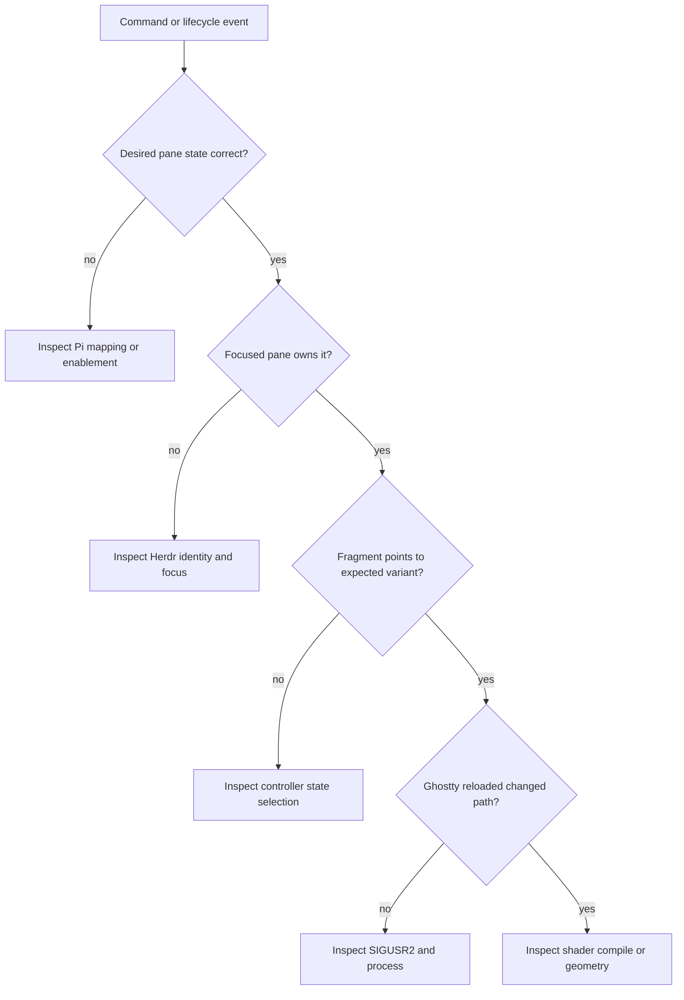

# Operations and Verification

Runtime truth lives under `~/.local/state/ghost-in-the-machine/`. Diagnose from intent toward pixels:



The stable runtime fragment matters more than `active.state`; it is Ghostty’s actual input. A manual `/ghost-*` command separates lifecycle mapping from render failures.

Before shipping:

```sh
npm run generate
npm run check
npm test
npm pack --dry-run
```

Then verify thinking, working, error, and done visually; focus a non-Pi Herdr pane and return; unfocus and refocus Ghostty. The tarball must contain the extension, controller, setup script, shaders, Herdr plugin, attribution, and this map.
