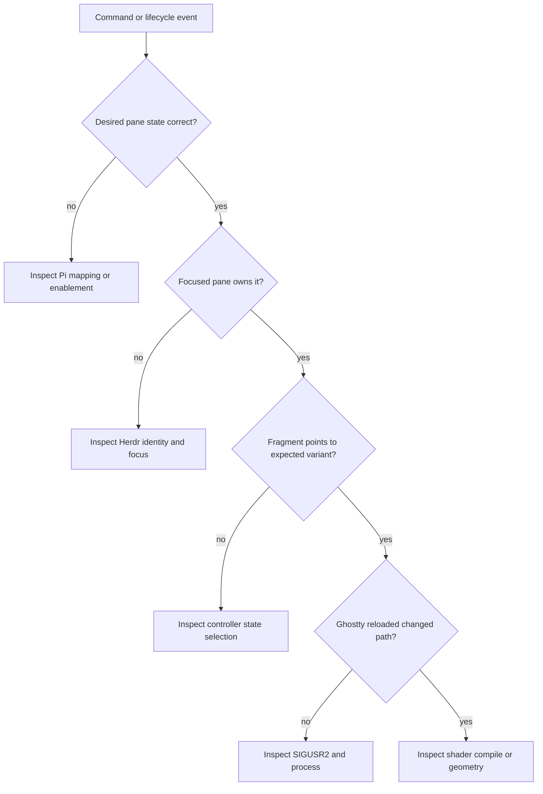

# Operations and Verification

Runtime truth lives under `~/.local/state/ghost-in-the-machine/`. Diagnose from intent toward pixels:



The stable runtime fragment matters more than `active.state`; it is Ghostty’s actual input. A manual `/ghost-*` command separates lifecycle mapping from render failures.

## Sidebar watcher

`ghost-state.sh status` reports the canonical API socket, watcher PID, sidebar gate, and active shader. Per-socket runtime evidence lives under:

```text
~/.local/state/ghost-in-the-machine/watchers/<socket-key>/
```

Read `socket-path` before trusting a stale PID. `watcher.log` records transitions, controller results, request errors and latency, plus a stop summary. `watch-start` recovers dead PID/lock files and returns the existing process for the same socket. `watch-stop` validates the watcher script and exact socket argument before signaling it.

The watcher exits after 100 consecutive API failures. It retries failed sidebar controller actions after one second without treating repeated geometry as a new transition.

Live verification on macOS:

```sh
scripts/verify-live-sidebar.sh
```

The script requires a focused Pi pane inside Herdr. It proves singleton startup, collapse-to-off, lifecycle suppression while collapsed, expansion restoration, and stop/restart. It leaves the sidebar expanded and the watcher running.

Reproduce the old/new idle comparison with no Ghostty state changes:

```sh
node scripts/benchmark-sidebar-watchers.mjs \
  --seconds 15 \
  --output ai-artifacts/docs/sidebar-watcher-performance.md
```

See [[ai-artifacts/docs/sidebar-watcher-performance|sidebar watcher performance]] for the measured result and its limits.

## Release

Before shipping:

```sh
npm run generate
npm run check
npm test
npm pack --dry-run
```

Then verify thinking, working, error, and done visually; focus a non-Pi Herdr pane and return; unfocus and refocus Ghostty. Run the live sidebar script when watcher behavior changes. The tarball must contain the extension, controller, watcher, setup script, shaders, Herdr plugin, attribution, and this map.
