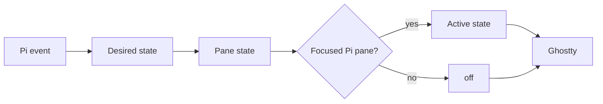

# Semantic Map

A ghost state is a projection of Pi activity, not a process state machine. Three copies can disagree legitimately:

**Desired state** is what one Pi session wants. **Pane state** is that pane’s last controller selection, including temporary `off`. **Active state** records what the controller last selected for Ghostty; a failed reload can leave rendered pixels behind it. Focus may set active state to `off` without erasing other panes.

`idle`, `thinking`, `working`, `done`, and `error` carry meaning. `off` only controls visibility. Manual commands and automatic lifecycle events converge on the same controller.

The **control plane** owns state, focus, config, and reload. The **render plane** owns pixels and receives no Pi or Herdr runtime identity, though its placement is tuned for the Herdr sidebar. Preserve that split.
