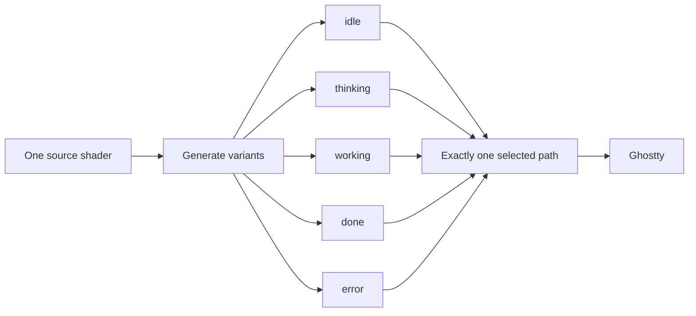

# Visual Model



Variants differ only by `FORCED_STATE`. Change the source, regenerate all variants, and commit them together. `off` normally removes `custom-shader`; it is not another animated state.

```text
viewport
┌──────────────────────────────┐
│  ↔ 0.5% minimum footprint gap│
│       ghost center: 40% ↓    │
│       size: 12.6% of height  │
│                              │
└──────────────────────────────┘
```

The gap clamps the full animated footprint, including drift and decorations. Ghostty coordinates are top-down in the tested renderer. Shared motion—breathing, drift, gaze, blink—makes every state feel like one creature. State-specific color and decorations carry the fast read: yellow/question, blue/effort, green/sparkles, red/worry.

`iFocus == 0` returns the untouched terminal texture. Herdr visibility is handled earlier by the controller.
